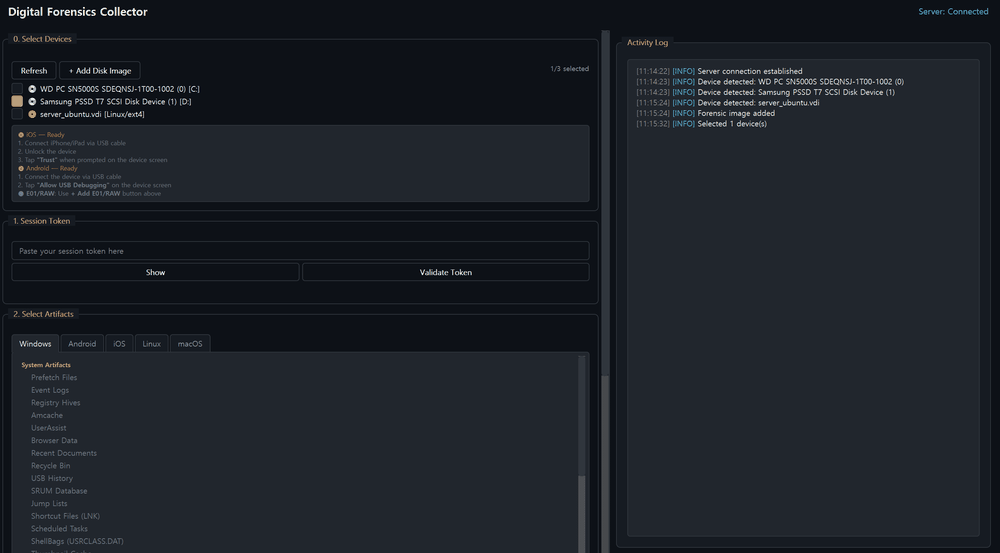
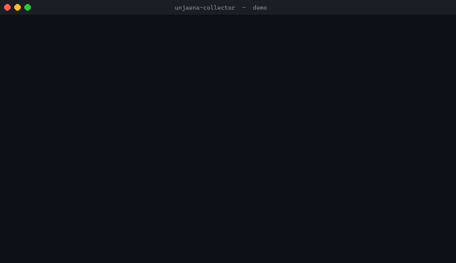

# unJaena AI Digital Intelligence Collector

The official evidence collection client for the unJaena AI analysis platform.

It collects authorized forensic artifacts from live endpoints, mobile devices,
offline mobile bundles, and disk images; preserves per-file integrity metadata;
and uploads the selected evidence to a configured analysis service.

<p align="center">
  
  <br>
  <sub><em>Windows GUI workflow</em></sub>
</p>

<p align="center">
  
  <br>
  <sub><em>macOS terminal workflow</em></sub>
</p>


## Current Release

The latest release is
[`collector-v2.6.2`](https://github.com/unjaena/unjaena-collector/releases/latest).

Pre-built release assets:

| Platform | File |
|----------|------|
| Windows x64 | `IntelligenceCollector-*-windows-x64.exe` |
| macOS Apple Silicon | `IntelligenceCollector-*-macos-arm64.dmg` |
| macOS Intel | `IntelligenceCollector-*-macos-x86_64.dmg` |
| Linux x64 | `IntelligenceCollector-*-linux-x64.tar.gz` |
| Checksums | `SHA256SUMS.txt` |

macOS builds are signed and notarized. Windows and Linux builds are currently
published without platform-native package signing; verify them with
`SHA256SUMS.txt`.

## Quick Start

### Use a Release Binary

1. Download the right asset from the
   [Releases page](https://github.com/unjaena/unjaena-collector/releases/latest).
2. Start the application.
3. Enter your analysis server URL when prompted. Users of the hosted service
   can use `https://app.unjaena.com`.
4. Enter a valid session token, select artifact categories, and start
   collection.

### Run From Source

```bash
git clone https://github.com/unjaena/unjaena-collector.git
cd unjaena-collector

python -m venv venv

# Windows
venv\Scripts\activate
pip install -r requirements/base.txt -r requirements/windows.txt

# macOS
# source venv/bin/activate
# pip install -r requirements/base.txt -r requirements/macos.txt

# Linux
# source venv/bin/activate
# pip install -r requirements/base.txt -r requirements/linux.txt

python src/main.py
```

Headless mode is available for controlled automation:

```bash
python src/main.py --headless --server https://app.unjaena.com --token SESSION_TOKEN --artifacts prefetch,eventlog
```

## What It Collects

### Live Endpoints

- Windows 10/11: registry hives, event logs, prefetch, MFT-oriented artifacts,
  browser data, USB history, cloud/app traces, messenger/social application
  artifacts, AI and coding-assistant traces, pagefile and hibernation files.
- macOS: unified logs, property lists, Safari/browser data, shell history,
  TCC, launch items, user artifacts, cloud/app traces, messenger/social
  artifacts, and AI/coding-assistant traces.
- Linux: systemd journal, audit/auth logs, shell history, cron/systemd
  schedules, containers, user artifacts, browser data, app traces, and local
  AI/coding-assistant traces.

### Mobile Devices and Mobile Bundles

- Android USB collection through the ADB protocol.
- iOS backup and artifact extraction through `pymobiledevice3`.
- Offline mobile filesystem bundles, including UFED/CLBX-style zip exports.

### Disk Images

The collector can register and collect from offline evidence images:

- E01 / Ex01, including segmented E01 sets
- RAW / DD / IMG / BIN
- VHD / VHDX
- VMDK
- QCOW2
- VDI
- DMG, including UDIF images and raw fallback

Supported filesystem access depends on the image contents and available
dependencies, but the disk layer is designed for read-only collection.

### Focused Collection Presets

`Privacy Incident Preset` selects a smaller set of artifacts useful for breach
triage, privacy incident response, CPO workflows, and 72-hour notification
review. It is intended to reduce unnecessary data collection compared with
selecting every artifact category.

## How It Fits With the Analysis Platform

The collector is the endpoint-side evidence acquisition component. The separate
analysis platform receives uploaded evidence and can provide artifact views,
search, timeline reconstruction, multilingual reporting, and AI-assisted
investigation workflows depending on the configured service.

This repository does not include the server-side analysis platform.

## Security and Integrity

- HTTPS/WSS is required for remote servers.
- AES-256-GCM authenticated encryption is used for upload transfer.
- Per-file SHA-256 hashes are recorded and verified during upload.
- Session tokens are not logged in plaintext.
- Operator consent selections are recorded with an HMAC-SHA256 integrity tag.
- Locally entered BitLocker or LUKS credentials are used in memory and are not
  transmitted as plaintext metadata.
- The collector performs no background telemetry. Network activity is limited
  to explicit connection tests, authentication, update checks, and uploads
  initiated by the operator.

See [SECURITY.md](SECURITY.md) for reporting and support policy details.

## Configuration

The release binary stores first-run server configuration at:

```text
~/.forensic-collector/config.json
```

Minimal runtime configuration:

```json
{
  "server_url": "https://app.unjaena.com",
  "ws_url": "wss://app.unjaena.com"
}
```

Source builds use build-time configuration files:

```bash
# Create a local build configuration first
cp config.example.json config.production.json

# Production build, reads config.production.json
python build.py --production

# Or create config.development.json for local testing
cp config.example.json config.development.json

# Development build, reads config.development.json
python build.py --development

# Override the server URL while building
python build.py --production --server-url https://app.unjaena.com
```

The GitHub release workflow generates `config.production.json` from the
`PRODUCTION_SERVER_URL` repository secret before building release assets.

## External Dependencies

| Component | Purpose | Notes |
|-----------|---------|-------|
| WinPmem | Optional physical memory acquisition on Windows | User-supplied binary; not bundled |
| libusb | Android USB communication | Required for source builds using direct USB access |
| Android platform-tools | ADB fallback on Windows | Bundled into Windows release assets by CI |
| Apple Mobile Device Support | iOS communication on Windows | Installed through iTunes or Apple drivers |
| libimobiledevice / pymobiledevice3 | iOS backup communication | `pymobiledevice3` is installed from requirements |

See [resources/USB_DEPENDENCIES.md](resources/USB_DEPENDENCIES.md) for mobile
USB setup details.

## Build

```bash
python build.py --check-deps
python build.py --production
```

Optional helpers:

```bash
python build.py --download-libusb
python tools/download_libimobiledevice.py
```

## Legal Notice

This software is provided strictly for authorized forensic activities, including
in-house incident response, contracted investigations, and authorized research.
You are responsible for ensuring that you have legal authority to run this tool
against any target system and for complying with applicable laws and policies.

This tool is not certified as a court-admissible evidence acquisition system.
If collected data may be used in legal proceedings, consult qualified counsel
and apply your organization's chain-of-custody procedures.

## License

This project is licensed under the GNU Affero General Public License v3.0. See
[LICENSE](LICENSE) for details.

This collector is a standalone client application. The separate server-side
analysis platform is independently developed and is not part of this repository.

## Key Dependencies and Licenses

| Package | License | Notes |
|---------|---------|-------|
| dissect.fve | AGPL-3.0 | BitLocker and LUKS support |
| dissect.cstruct | AGPL-3.0 | Binary structure parsing dependency |
| pymobiledevice3 | GPL-3.0 | iOS communication |
| PyQt6 | GPL-3.0 / Commercial | GUI framework |
| pytsk3 | Apache-2.0 | The Sleuth Kit bindings |
| adb-shell | Apache-2.0 | Android ADB protocol |
| libusb1 | LGPL-2.1 | USB access |
| cryptography | Apache-2.0 / BSD | Cryptographic operations |

## Community

- [GitHub Discussions](https://github.com/unjaena/unjaena-collector/discussions)
- [GitHub Issues](https://github.com/unjaena/unjaena-collector/issues)
- [LinkedIn](https://www.linkedin.com/in/unjaena)

## Contributing

This project is source-open for transparency. Because evidence collection code
directly affects data integrity and investigation quality, pull requests are not
accepted at this time.

Bug reports, compatibility issues, and artifact requests are welcome through
GitHub Issues. Security reports should follow [SECURITY.md](SECURITY.md).
